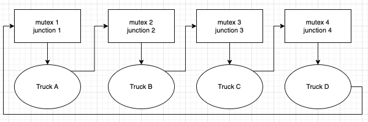

# HW5

Nick Chao | yc6371

## q1

### (1) What’s the output of this program?

```bash
main: 1
child: 1
child: 2
main: 2
```

### (2) Alice thinks that each thread should have a separate stack. However, changing arg in the child thread also changes the value in the main thread. What’s the error in Alice’s reasoning?

Although each thread within the same process has its own stack, they still can access each other's stack. In this case, the child thread is still accessing the stack of the main thread.

## q2

### Is there any problem with this code? If so, can you help Alice correct it?

The `i` value that the child thread copy from the main stack might have changed to different value. The correct way to do this is to pass an indexed integer array as the argument to the child thread, and the child thread will copy that value from the array.

```c
int args[5];
...
args[i] = i;
pthread_create(&tid[i],NULL,run,&args[i]);
```

## q3

### (1) What’s wrong? (Give a problematic interleaving.)

Say thread 1 and thread 2 are both executing `transfer_bob_to_alice()` and Bob only has `trans+1` amount of moeny. Let's have thread 1 execute first. When thread 1 finishes executing the if clause and determines Bob has enough money, the scheduler switch to thread 2. Thread 2 will execute the if clause and also determines Bob has enough money. This will result in transferring `2*trans` amount of money from Bob's account. This is a problem because Bob only has `trans+1` amount of money.

### (2) State the fix in one sentence

Include the if clause into the critical section as well.

## q4

### (1) Why are the four necessary conditions of a resource deadlock all satisfied in this scenario? Draw a resource allocation graph to elaborate on your answer



1. mutual exclusion: only one truck can enter a junction (resource) at a time
2. hold and wait: each truck holds a junction while waiting for another one
3. no preemption: a truck cannot be forced to be out of a junction
4. circular wait: track A waits for track B, track B waits for track C, track C waits for track D, and track D waits for track A

### (2) The government of Old Essex soon issued legislation that every truck entering the city must have a length smaller than the width of the City Hall, assuming that the City Hall is square and that only one car can enter a road at a time. Which necessary condition of a resource deadlock would this legislation eliminate?

hold and wait

### (3) Assume that no two cars would step into the traffic detecting zone at the same instant. Which necessary condition of a resource deadlock would the traffic lights eliminate?

circular wait
